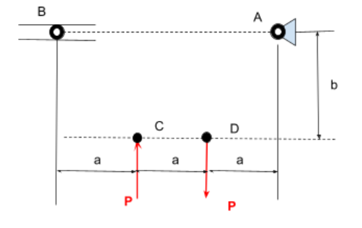

# A2 – Truss Stress Analysis

## Goal:
There is a required truss design needed which has four points of contact. It must be created to support a predetermined amount of weight without breaking. The four points of contact are as follows in this image:

The force P is between 20-30kN, the length of a. is 0.4m, and the height of b. is 0.3m. The beams will be made of A500 structural steel and the pins will be made of hardened tool steel with a yield shear strength of 170 ksi and a density of 0.278 lb/in^3. Point A is a pin and point B is a roller.

In order to begin the project, I drew out a rough sketch of the diagram given on a scrap piece of paper. I went few a couple designs and decided to go with the second one which has a singular beam running across from point A to point C. I chose this because it was unique, and could pose a challenge to me. There were many options for design, but only some were realistic for the scenario at hand. One of the potential designs was a hexagonal shape that doubled and mirrored the final design I went with. 

## Analyze
Utilizing a Free Body Diagram, the forces put on each individual point(A,B,C,D) become available to use when calculating the final design of the truss.

## Decide
To finalize the geometry of the truss, a double triangle was an effective yet simple design choice. The double triangle require less beams while holding the same weight, which makes it a smart choice for a truss.

