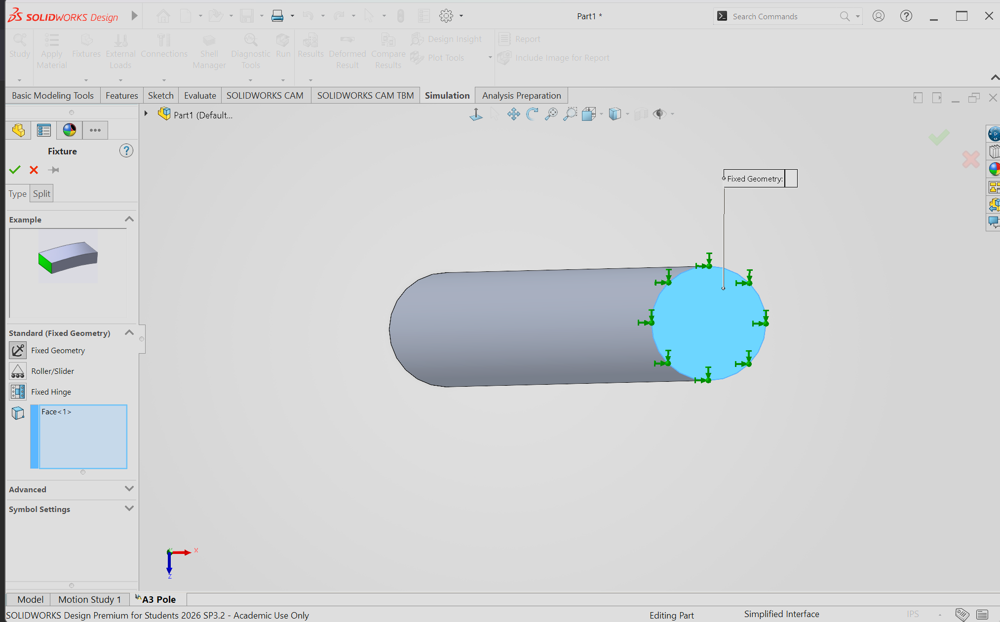
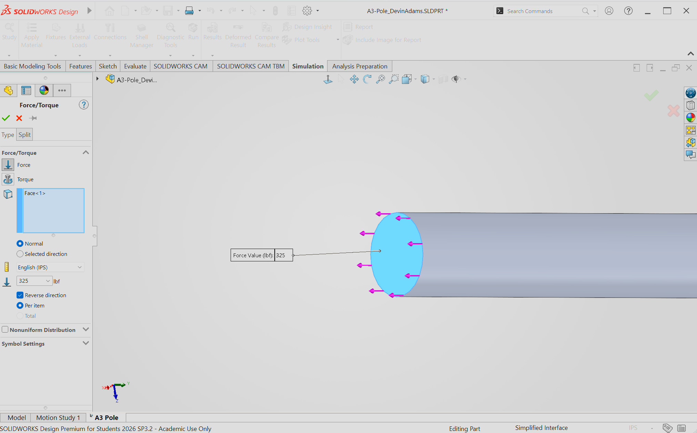
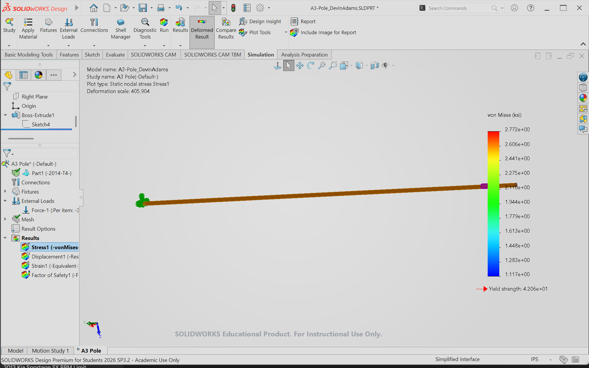
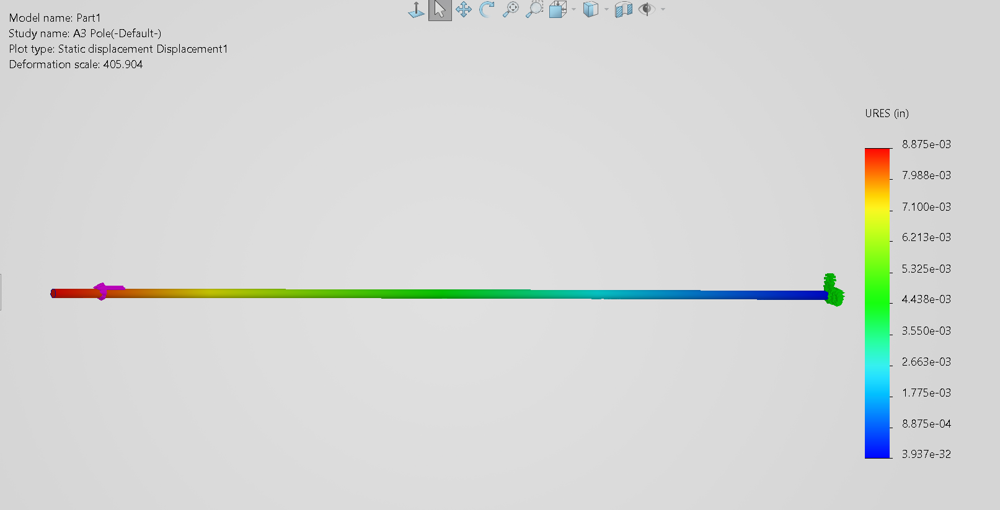
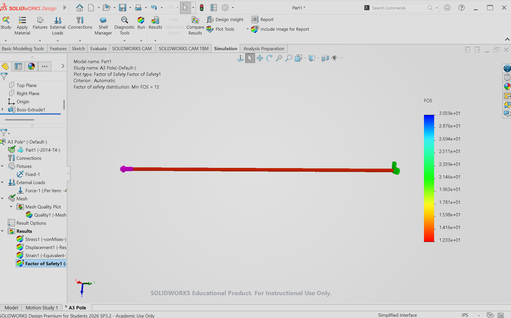

# Parametric and FEA

## Part 1: <u>Design</u>
This assignment was to create a bar in CAD with a direct load between 300 lbf and 500 lbf. The maximum allowed axial deflection of the bar is 0.009 inches and must be made from Aluminum with a range of Young’s Modulus from 8.5-11.5 10^6 psi. The cross section is to be determined by myself and I went for a small thickness of 0.4 inches, with equal height and width. For my load, 325lbf was the value I picked, which is on the lower end of the recommended scale. Using the formula given in the Machinery's Handbook, I calculated a maximum length for the bar to be ~46.53 inches with the type of aluminum used being 2014-T4 which matched the Young's Modulus requirement at 10.5*10^6 psi. For my final length of the bar, I took a generous 10 inches off of the total length for a higher Safety Factor and tolerance. I made sure to change all of the units in SolidWorks to imperial for ease of legibility. These are used for the calculations shown in the paper.

<u>CAD Modeling</u>

The dimensions I chose were modeled as shown.

## Part 2: <u>Computer Calculated Mapping</u>
During this stage of the assignment, force and fixture modifiers are needed in order to digitally calculate the von Mises and deflection variables. Using the Mass Properties tab the Mass is calculated to be 0.16 pounds. 

<u>Fixture Modifier</u>

Using the Fixture Menu and selecting Fixed Geometry, one side of the bar is fixed in place

<u>Force Modifier</u>

Inside of the External Loads folder, selecting Force allows for a 325lbf load to be placed on the other side of the bar.

<u>von-Mises Curve</u>

The maximum stress dictated by this von-Mises map is 2.772 ksi, well below the yield strength which is expected.

<u>Deflection Curve</u>

The maximum deflection dictated by this displacement map is 0.008875 inches, which is close to the 0.009 inch maximum limit.

<u>Max Stress and SF</u>

**The yield strength of the aluminum came out to be 2.9x10^8Pa, equivalent to ~$42.1 ksi and the maximum stress put on the bar was 2.2772 ksi. The bar had a safety factor in this scenario of 12. The bar is safe.

## Part 3: <u>Reflection</u>

My hand calculation for the deflection of the aluminum bar was quite a bit off. I had 0.00696 inches for my hand calculation, but 0.008875 inches for the computational calculation with the mapping. There was a 24.12% percent difference. Both values were below the 0.009 inch maximum limit but the discrepancy is noticeable. 

I think one source may be from the way the fixtures and loads were applied in the CAD for such a small bar. Id have to trust the hand calculations more because I am a bit skeptical of how the points are held in place.

## Part 4: <u>Lessons and Investments</u>
It took me about 4 hours to complete this assignment. I learned how much the intricacies of real world scenarios may affect bars and cannot be directly calculated with just one value. I learned that despite choosing imperial units at the beginning of the solidworks session, there are still a few other places the units need to be changed for the swap to be whole. I played around with the length of the bar and the load pulling on the end of it. A big mistake I made was in the creation of the bar I forgot to choose a specific metal and had to search what was wrong. I also neglected to add the force module to one of the ends and I got an error. 
## Files

