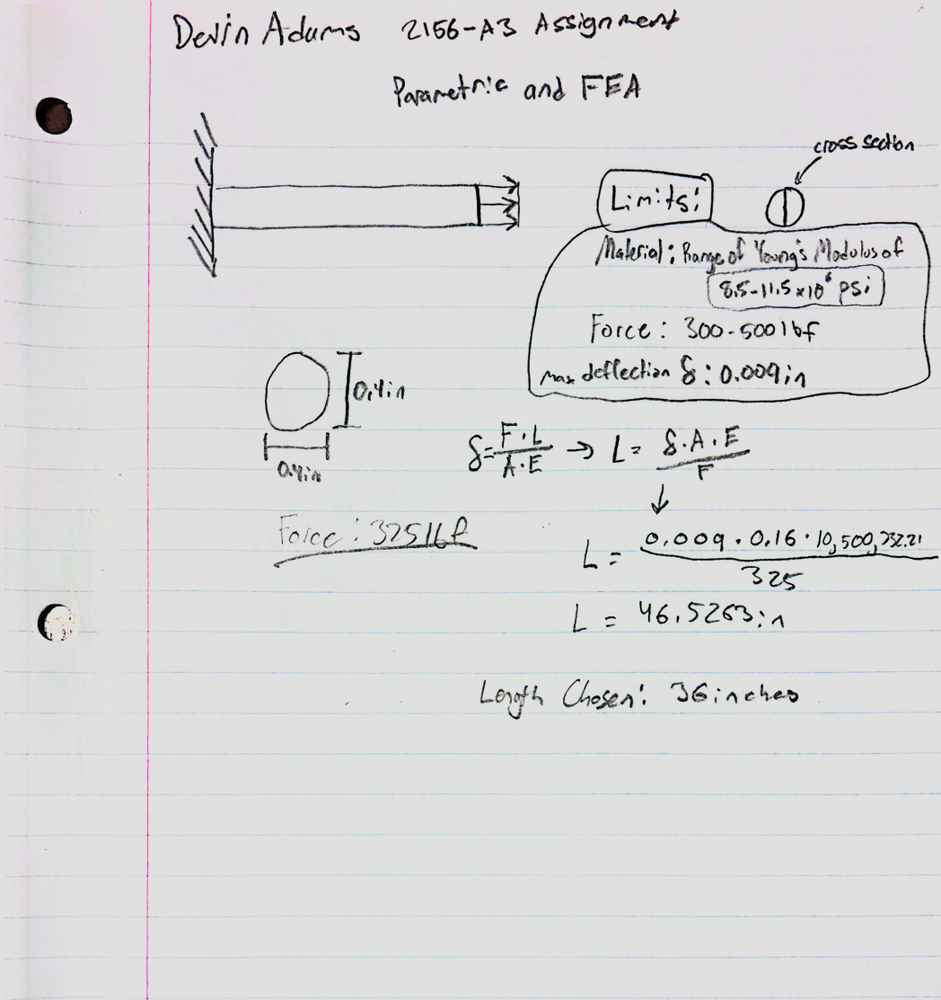
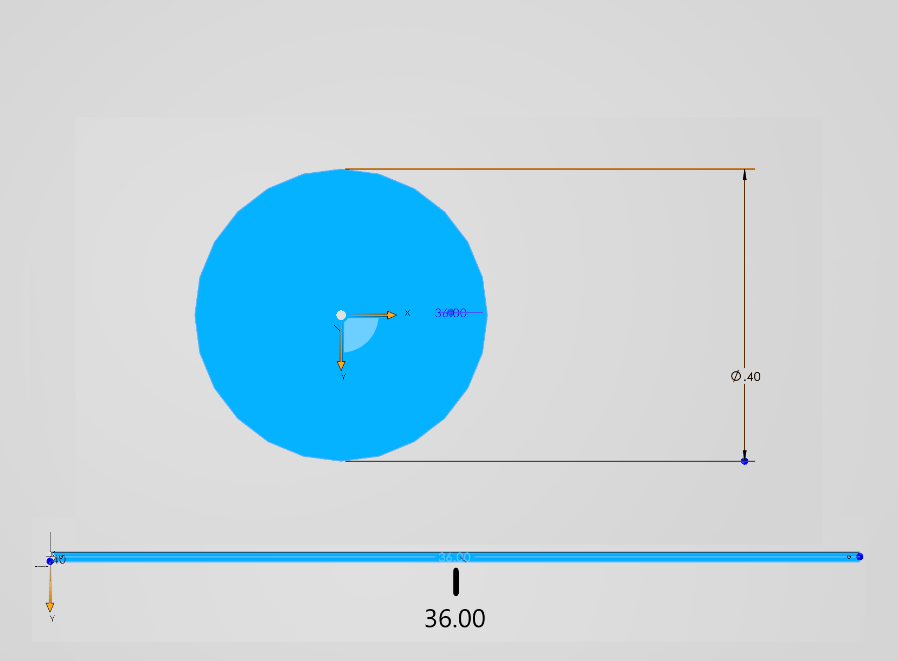

# Parametric and FEA

## Part 1: <u>Design</u>
This assignment was to create a bar in CAD with a direct load between 300 lbf and 500 lbf. The maximum allowed axial deflection of the bar is 0.009 inches and must be made from Aluminum with a range of Young’s Modulus from 8.5-11.5*10^6 psi. The cross section is to be determined by myself and I went for a small thickness of 0.4 inches, with equal height and width. For my load, 325lbf was the value I picked, which is on the lower end of the recommended scale. Using the formula given in the Machinery's Handbook, I calculated a maximum length for the bar to be ~46.53 inches with the type of aluminum used being 2014-T4 which matched the Young's Modulus requirement at 10.5*10^6 psi. For my final length of the bar, I took a generous 10 inches off of the total length for a higher Safety Factor and tolerance. I made sure to change all of the units in SolidWorks to imperial for ease of legibility. These are used for the calculations shown in the paper.

###<u>CAD Modeling</u>

The dimensions I chose were modeled as shown.

## Part 2: <u>Computer Calculated Mapping</u>
During this stage of the assignment, force and fixture modifiers are needed in order to digitally calculate the von Mises and deflection variables. Using the Mass Properties tab the Mass is calculated to be 0.16 pounds. 

<u>Fixture Modifier</u>
Using the Fixture Menu and selecting Fixed Geometry, one side of the bar is fixed in place
[image of fixture]

<u>Force Modifier</u>
Inside of the External Loads folder, selecting Force allows for a 325lbf load to be placed on the other side of the bar.
[image of force]

<u>von-Mises Curve</u>
The maximum stress dictated by this von-Mises map is 2.772 ksi, well below the yield strength which is expected.
[image of von-Mises]

<u>Deflection Curve</u>
The maximum deflection dictated by this displacement map is 0.008875 inches, which is close to the 0.009 inch maximum limit.
[image of deflection]

<u>Max Stress and SF</u>
**Check the maximum stress is lower than the strength of Aluminum (Sy = 40 ksi) and note the safety factor. **||||||||||||||||||||||||

## Part 3: <u>Reflection</u>
    (5%) Report the axial deflection from your parametric hand-calculation and from your FEA. Calculate the percent difference between the two.

    If there is a meaningful discrepancy, identify at least one likely source (e.g., assumptions in the hand-calc, boundary conditions, mesh density, material property inputs).
    If the two values are essentially the same, explain why you'd expect them to agree for this geometry and loading (e.g., no stress concentrations, simple axial loading, coarse mesh still adequate for a uniform cross-section).
    Either way, state which result you'd trust more for this design and why.

    (5%) Now imagine a fairly substantial pin hole on the left side of the bar. Look up the stress concentration factor (Kt) for a hole in a flat bar in tension (Peterson's charts or Machinery's Handbook). Using your FEA's nominal stress away from the hole, estimate the peak stress at the hole and state whether it would still pass your safety factor. (Don’t redo the FEA!)

## Part 4: <u>Lessons and Investments</u>
Lessons Learned document mistakes made and actual time spent from start to finish. 

## Files
[file of the thing]
