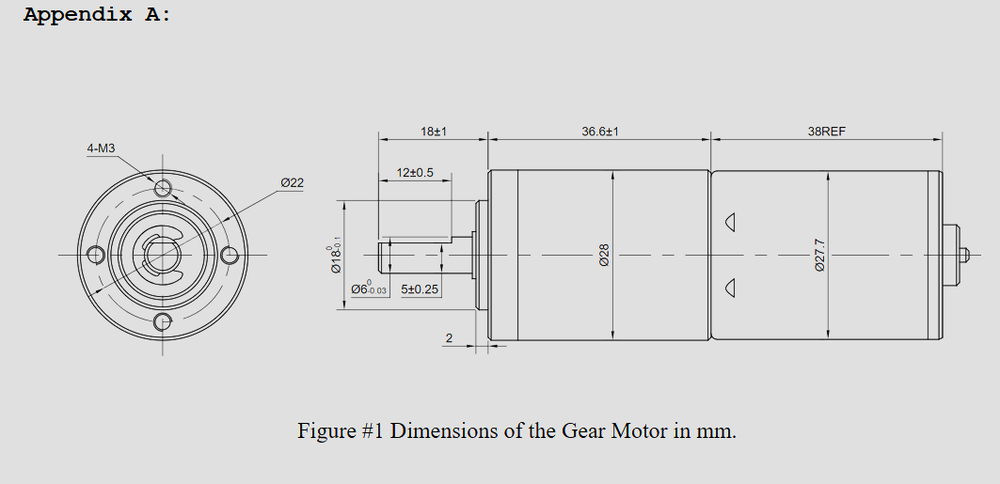
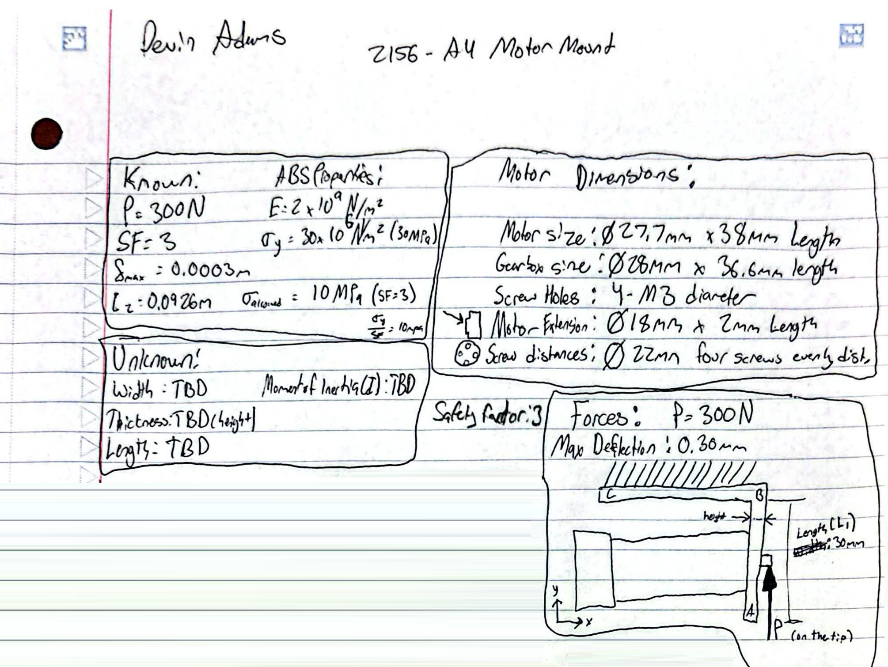
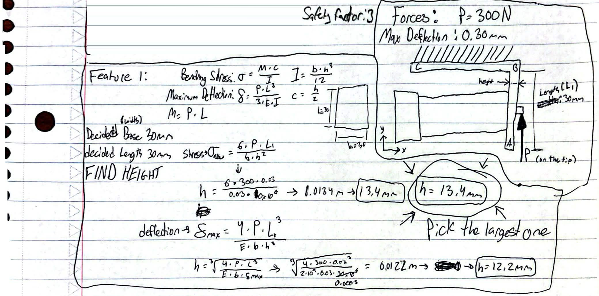
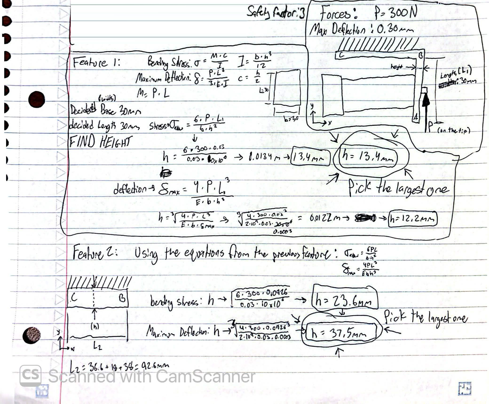
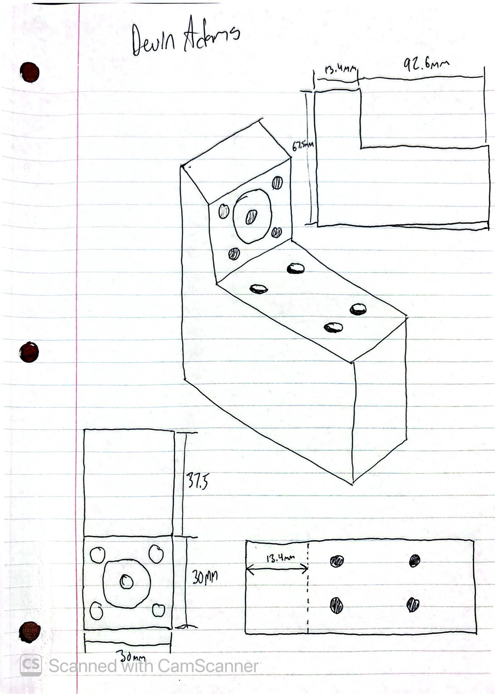
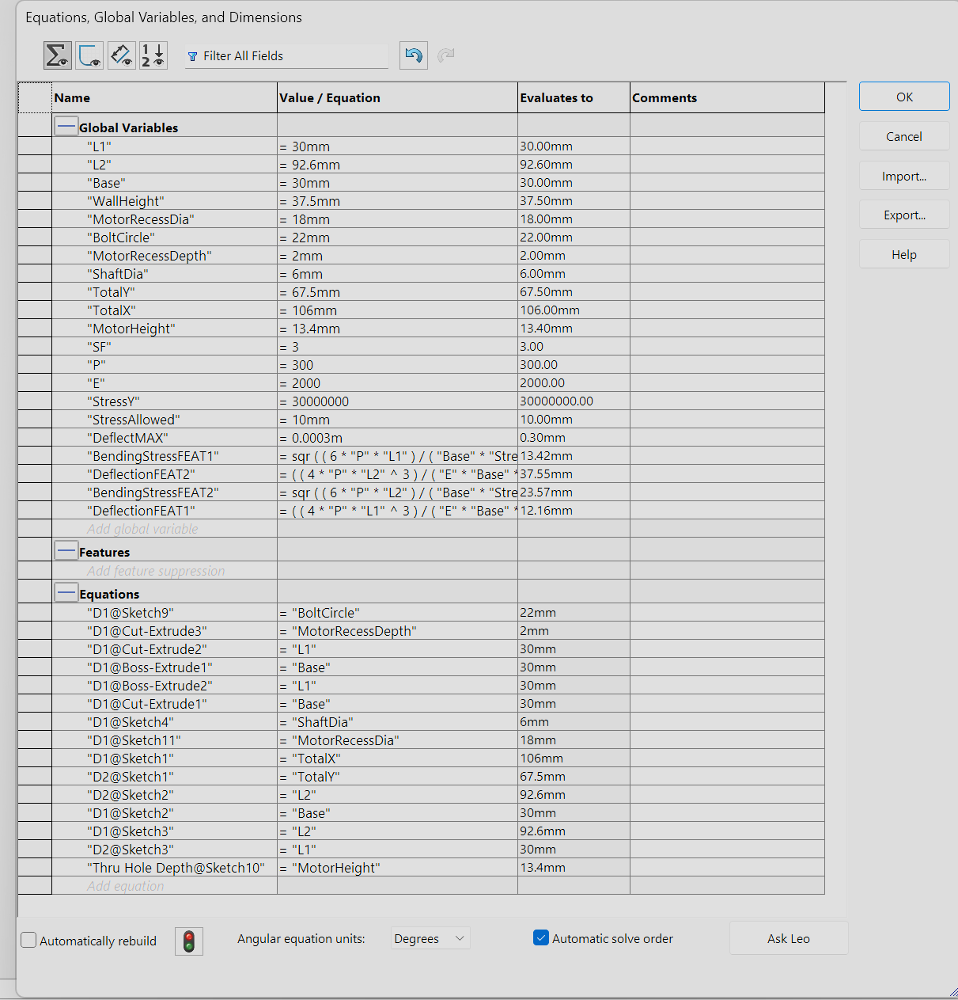
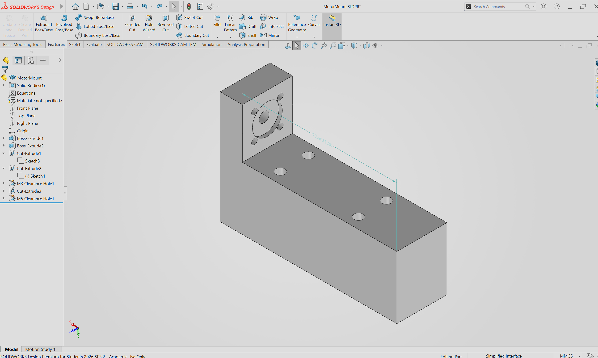

# A4 – [Motor Mount]

The purpose of this assignment is to create a functional motor mount bracket to hold the given motor below(dimensions in mm). The deflection for the mount is limited to 0.3mm with a 300N load placed on the end of the motor shaft, neglecting the weight of the motor in all calculations. The material used to create the motor mount can either be PETG, ABS, or PLA. A safety factor of 3 is in place for this design which takes into account holes in the design for screws and for the shaft of the motor. I researched some motor mount designs online and found the one at the bottom to base mine on.
Below are the dimensions of the DC motor.

## __PART 1:__ <u>Feature 1(Motor Attachment)</u>

**<u>Knowns, Unknowns, and Deciding Dimensions</u>**

I went with ABS Plastic for the material of the mount. It poses a challenge to use plastic for a motor mount experiencing so much force, however, with enough size used it can perform as well as other types of material. The Elasicity Modulus is 2x10^9 N/m^2 and the strength is 30MPa. Individually each of the data points were plotted out to make it easier to solve later on. I had trouble deciding on an L2 length and went with the total length of the entire motor. 

**<u>Calculating Geometry</u>**

Using the formulas from the machinery book and using the allowed stress from the finding knowns and unknowns, I determined which variables were needed to still be found and how they fit into the bending stress and maximum deflection formulas. Considering the 28mm maximum diameter of the motor, i chose 30mm by 30mm for the base and length for the motor attachment side of the motor mount. After re-arranging both the formulas to find h, it was plug and chug from there and was given two height values, the largest one being 13.4mm which was chosen.

 I did have a bit of trouble in this part because I was incorrectly inputting stress(y) instead of allowed stress into my formula and got a wildly large number for thickness that would not allow the motor shaft to even stick through the mount.

## __PART 2:__ <u>Feature 2(Wall Attachment)</u>

Utilizing the transformed equations from Feature 1, I am able to plug in the L2 of the wall side of the motor mount and the largest height calculated was 37.5mm, which left me with the full geometry of the motor mount not including screw holes and space for the motor shaft. The safety factor of 3 will help in making sure nothing bends or breaks with the added holes.

## __<u>Motor Mount Isometric Sketch</u>__

Below is a hand-drawn sketch of the motor mount created. 

## __<u>SolidWorks 3D CAD Model: Motor Mount</u>__

I started off creating all of the variables and each modified equation I used to get my heights.

##**FILES**

[file of the bar part](MotorMountFinal.SLDPRT)
