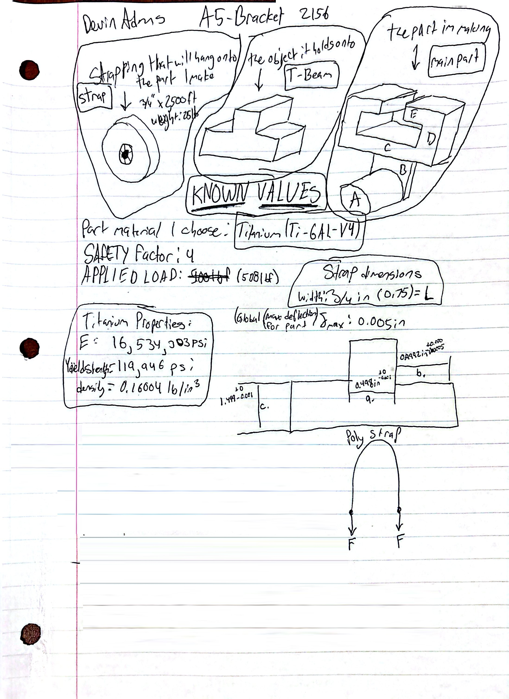
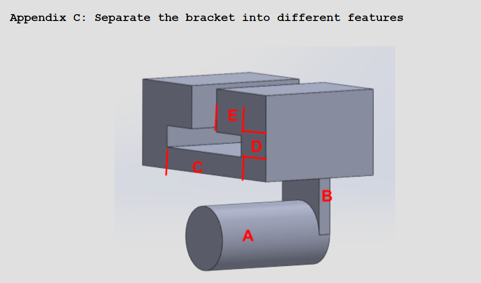
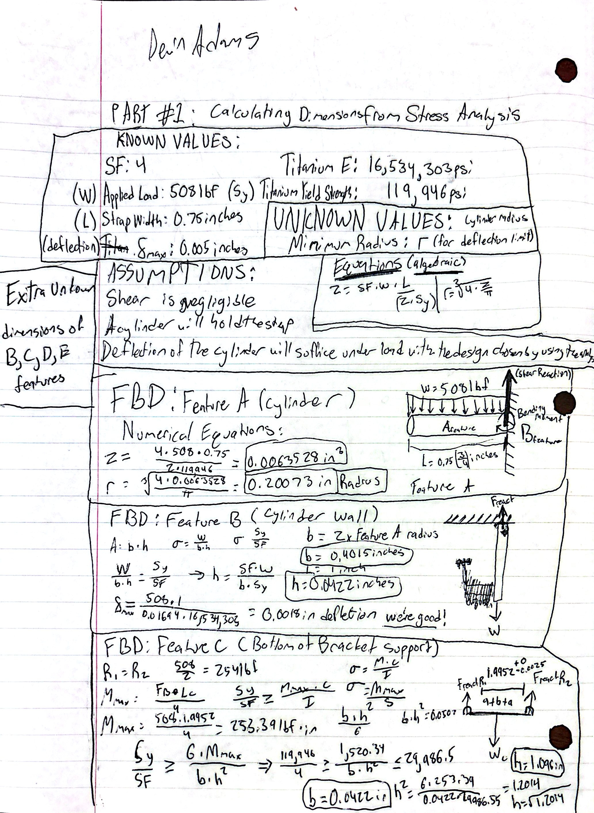
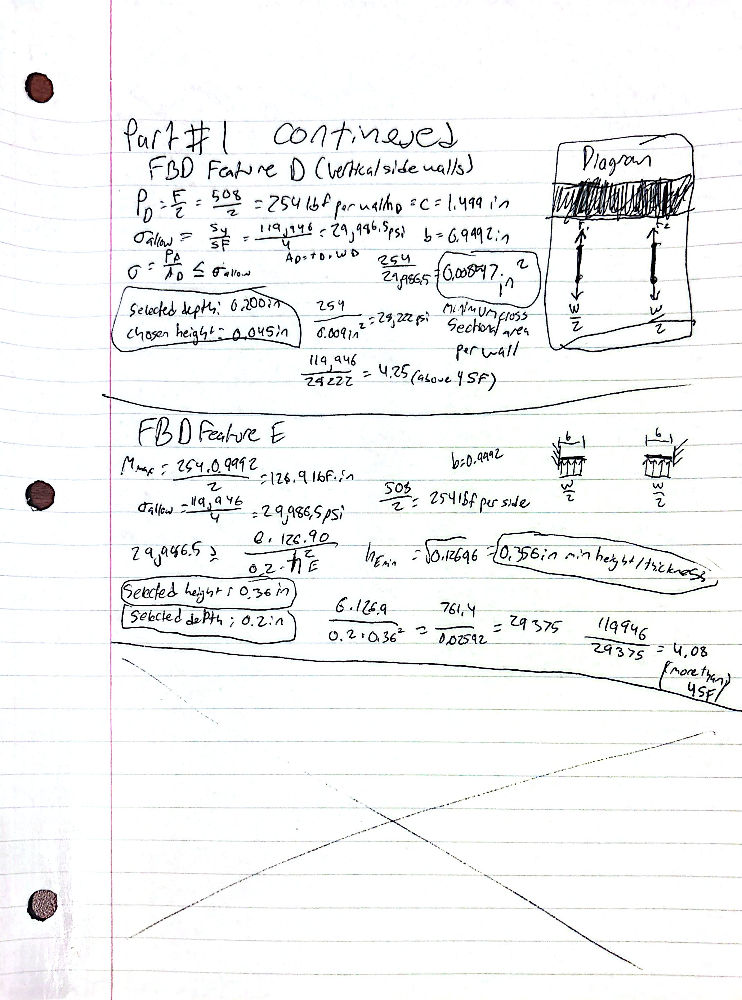
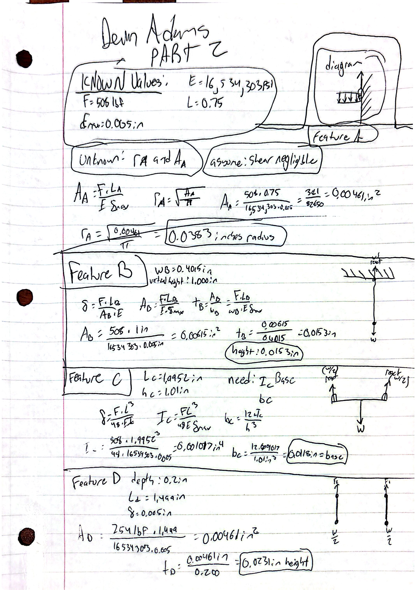
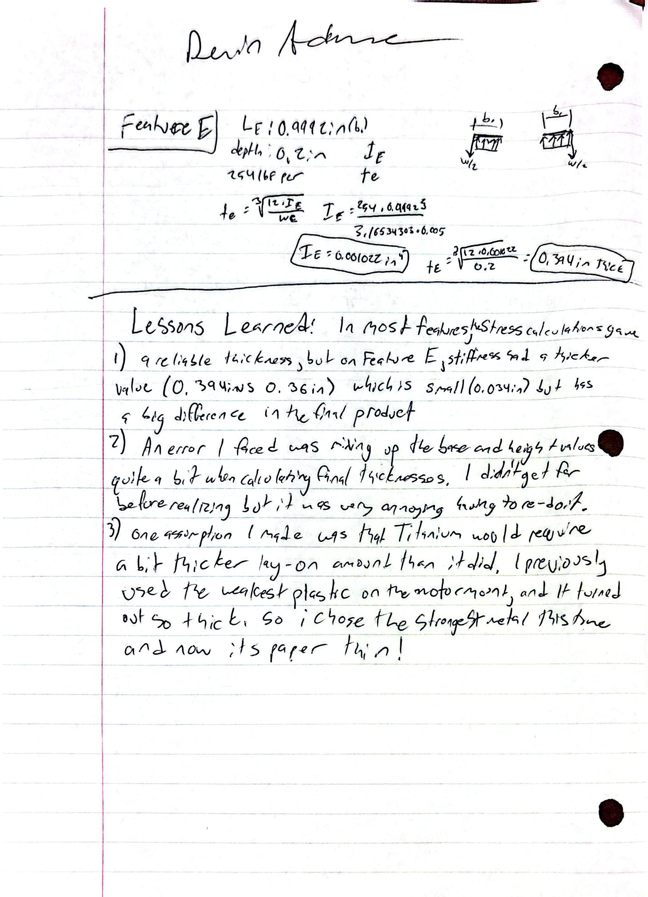
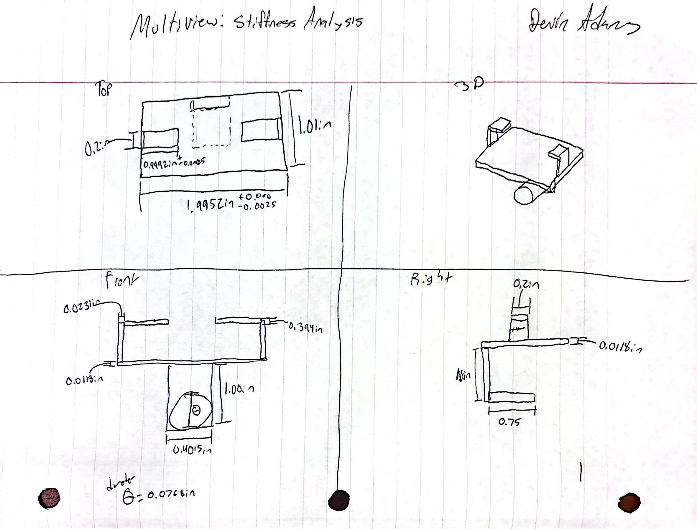
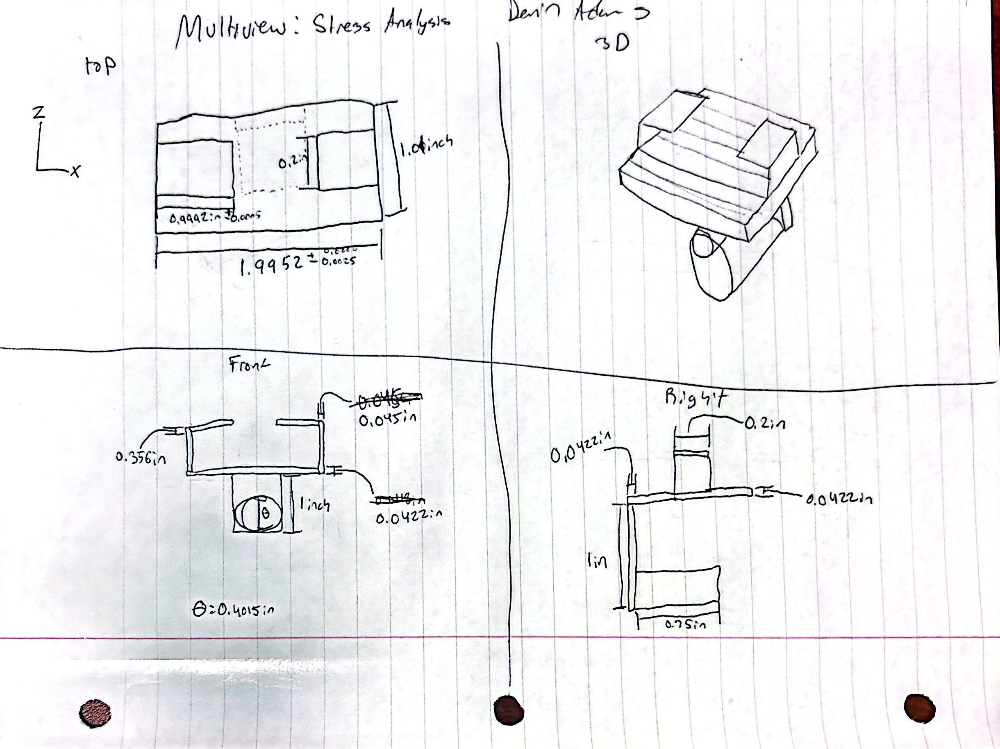

# A5 – Bracket Design

The purpose of this assignment is to design a bracket to hold a 0.75in wide strap that has 500lbf<F<800lbf of force put on it. The choice between  aluminum 6061 T6, Steel (ASTM A36), or Titanium (Ti-6Al-4V) was given for this particular assignment. I went with Titanium as it was the strongest metal on the list and sharpy contrasts the weak ABS plastic I chose for my previous project. To make it a bit easier to process, I created a visual aid a few days before which contained images and data that would tell me what I was building. The Titanium that i used had a very high elasticity modulus and yield strength. A safety factor of 4 is required for all parts of the project, and for the force put on the strap, I chose 508lbf. We are to assume no failure can occur due to direct shear stress. 

**<u>The visual aid:</u>**

## __PART 1:__ <u>Calculating Dimensions from Stress Analysis</u>

**<u>Knowns, Unknowns, and Deciding Dimensions</u>**
For the length of the cylinder, I went with an uncomplicated 0.75 inches. the strap has a width of that amount so it makes sense not to go below that, and nothing is to be gained going above that unless the bracket in this specific scenario was using a different width strap. Using the formulas in Appendix A, I went through each Free body diagram and determined which factors of the equation already existed, which needed to be created for narrowing down variables, and ensuring some sort of organization throughout the project. 0.4015 inches and 0.2 inches are two sizes that I used to keep similarity among all of the features. 

**<u>Thought Process</u>**
All of the thicknesses of each plate are very small decimal numbers. During this point of the project I was not concerned about the bracket being too big like with the ABS project, but too small. 

## __PART 2:__ <u>Calculating Dimensions from Stiffness Analysis</u>

For this part of the assignment, it was a bit easier to go through each of the features as I had gotten the hang of drawing the FBDs and formulas. After seeing the first radius for the cylinder, I was thinking the rest of these values would be very small, which I was mostly correct.

On the final Feature, the thickness of the metal actually exceeds the prior highest set by the Stress Analysis. it was very close, near hundredth of an inch, but could be enough of a difference in some scenarios that could cause it to fail if it was too thin.

## __PART 3:__ <u>Generate Multiview Sketches (10%)</u>

## Lessons Learned

