# A6 – Bracket Drawing (part 1)

For this assignment we are parametrically designing the bracket that was dimensioned in the previous assignment to meet a maximum deflection of 0.005 inches per component. This was done by calculating the given stress and strength needed at various areas to give a thickness that is satisfactory to meet the requirement. Ultimately Stress was the limiting factor, so the dimensions given in the stress equations are what the current design will be using. Below are the given instructions on what the bracket was supposed to be designed around, which was a rigid T beam. For the design process, I chose Titanium (Ti-6Al-4V) to be the material of the bracket and will use the stress dimensions from the previous assignment for this one.

**<u>The T Bracket Base</u>**

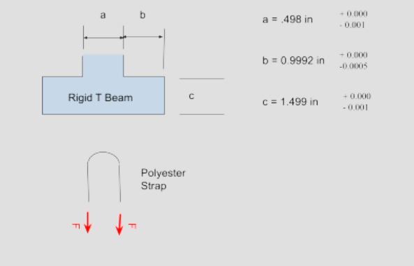

## __PART 1:__ <u>Parametric Design</u>

**<u>Getting Started</u>**

Designing in SolidWorks is new to me, while this is a documentation of building the bracket to fit onto the T Bracket Base, it is also a documentation of the failures and mistakes I made while creating this part. I started off creating the cylinder wall since it is lowest to the ground. It is based on my stress analysis calculations from the previous assignment.

To begin, I started building the cylinder wall and realized when extending the length to the parametric definitions I had saved, it would not equally lengthen both sides of the rectangle sketch. Later I figured out I had to use centerlines with midpoint lines to accurately center the base of the bracket.
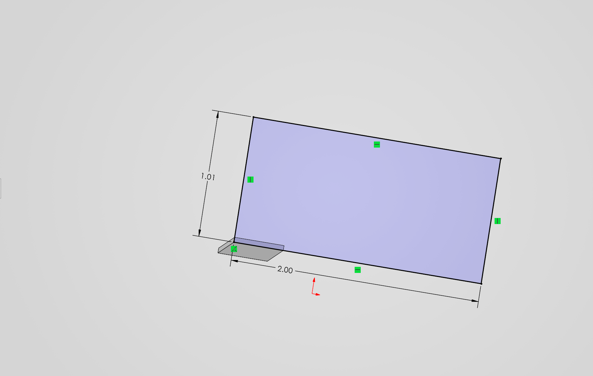

Here is the centered base. Later I had to extend it to include my vertical walls for the bracket, and I did not realize until much later on in this process.
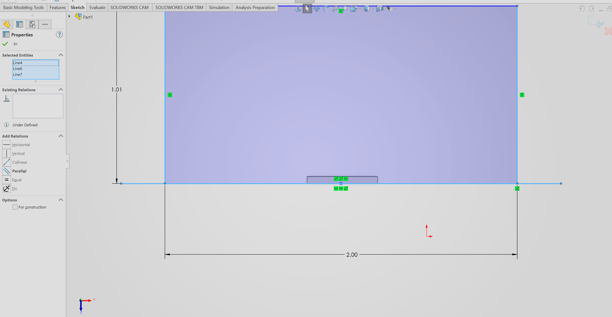

After finishing the base and cylinder wall, I started on the cylinder. After perfectly attributing its diameter parametrically, when I went to extrude I realized it was attached to the plane behind the part.
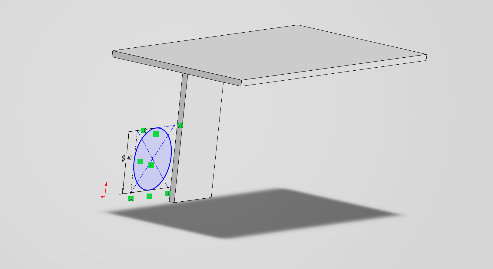

A bit of research led me to "Edit Sketch Plane" which allowed me to easily pin the sketch to the wall. 
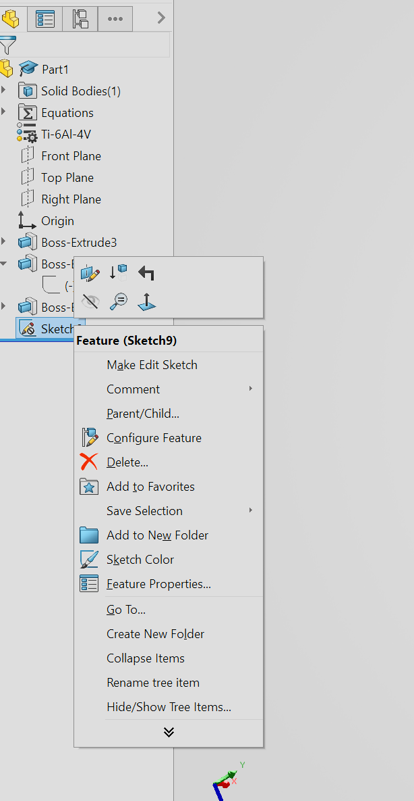

After getting the cylinder pinned down, and fixing the base dimensions, I worked on the vertical walls. These gave me trouble due to the base dimensions I previously made, which didnt account for the thickness of the vertical walls. After all adjustments to the previous steps I extruded these upwards and was left with this:
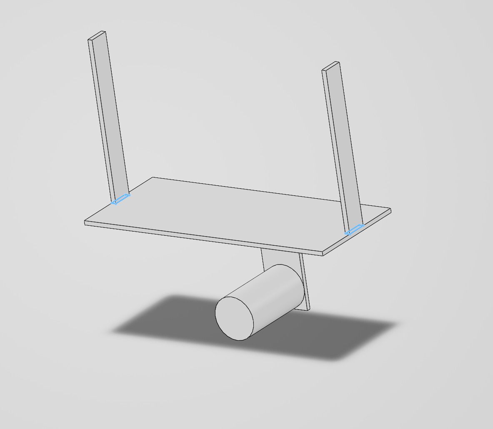

Horizontal top walls were probably the easiest part of this design. just two centerlines were used since my previous calculations evenly lengthened the horizontal and vertical walls to ~0.20 inches, kind of like claw grabbers. The dimensions were parametrically adjusted as all dimensions start off as close approximations.
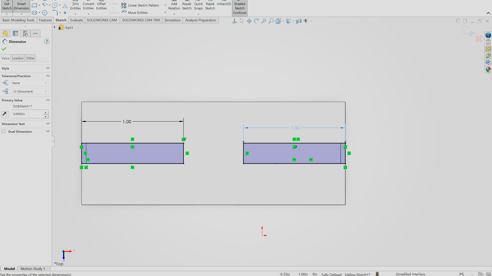

Here is the final resulting design using Titanium. 
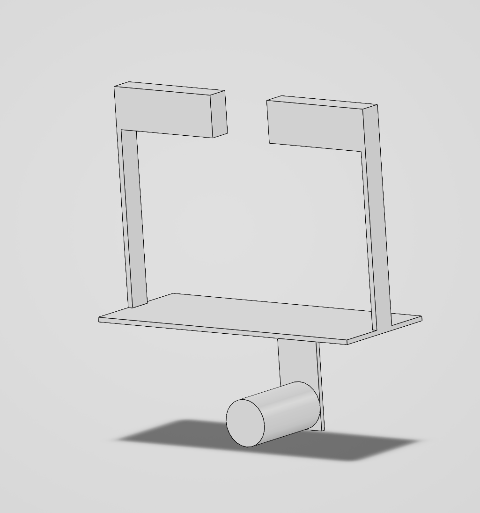

**<u>Thought Process</u>**
I went with a bottom up approach. Despite my mistakes, it proved to be effective. I was considering taking a big cube and carving out chunks from it until the part i needed was done, but I figured it would be more work to try and simplify it like that than to actually just do the work how it should be done. At one point I tried starting from the middle of the bracket at the base, but it did not turn out well and I kept getting errors for reasons I cannot explain.

HERE ARE THE PARAMETERS:
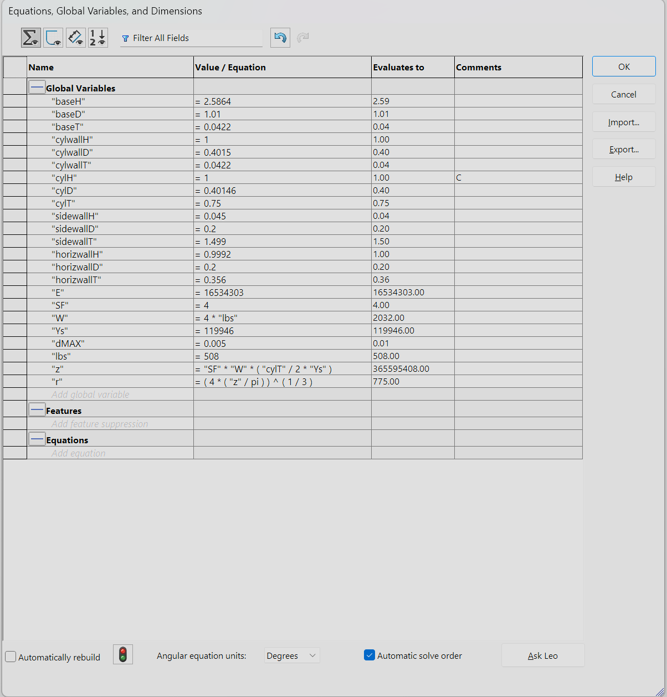

## __PART 2:__ <u>Drawing</u>

With additional work, the product is polished a bit more resulting in this. the base diameter was finnicky.
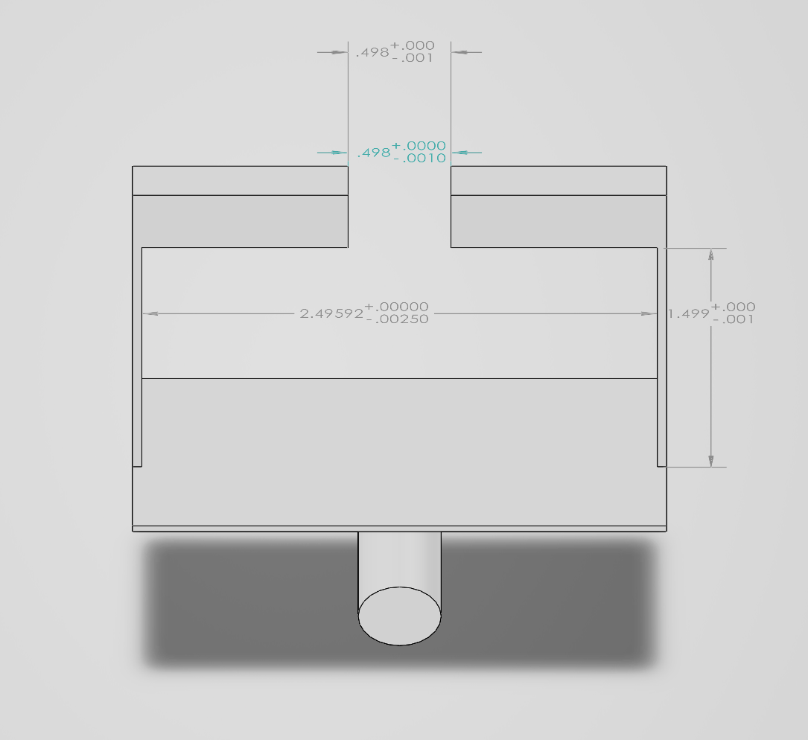
In third angle projection, with tolerances matching the bracket, I am able to see the dimensions and tolerances of my work with ease. 
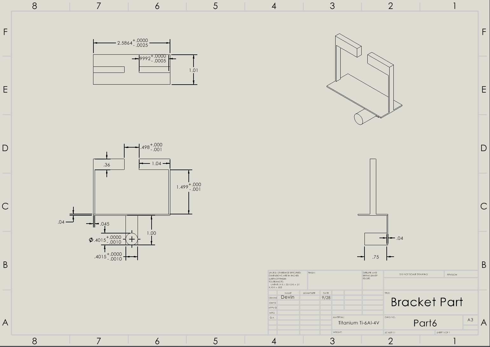

## __PART 3:__ <u>Reflections</u>
I learned a lot from this assignment, and how a simple extra zero can cost a lot of money when researching how to set tolerances in SolidWorks. It took about 1:30 Hours:Minutes and was fun to tolerance each part. This is my baby even if it is a little bit ugly in its current form.

I used strength to drive most of the dimensions in this. The horizontal walls on the very top of the bracket are the most notable due to their thickness. I intentionally made them slightly thicker than the original equation i based that dimension off of just to make sure everything would possibly have a chance at turning out alright if this was ever built as a real bracket. It was my "Z" equation that is in the parametrics with a B*H calculation. It did not get reworked at all.

One Dimension of the drawing in which i applied a tighter tolerance class to was the cylinder diameter and cylinder wall length because it is very important that the surface that touches the strap doesnt get cut or rub poorly in any of the areas, so I gave it a tighter tolerance to account for it, along with any material a strap may rub off. I applied a loose tolerance to the 0.36 horizontal walls because I already added a little bit extra, so I worried less about the specific variation of that section. While it is part of the bracket mounting area, the 0.1499 tolerance should take care of it, while the loose tolerance on the horizontal wall would just cause it to be taller or slightly shorter. If i were to apply the tightest tolerance across my entire drawing by default, it would cause the entire bracket to be exponentially more expensive(5x-10x) without providing necessarily any greater benefit to its purpose

## FILES

Part: [the part ](Part6.SLDDRW)
Drawing: [the drawing](Part6.SLDPRT)

## Lessons Learned
-------------------------------------FILLL IN HERE

An error I faced was mixing up the base and height values quite a bit when calculating final thicknesses. I didn't get far before realizing but it was very annoying having to re-do it. 

One assumption I made was

It took ~6 hours to complete this project

